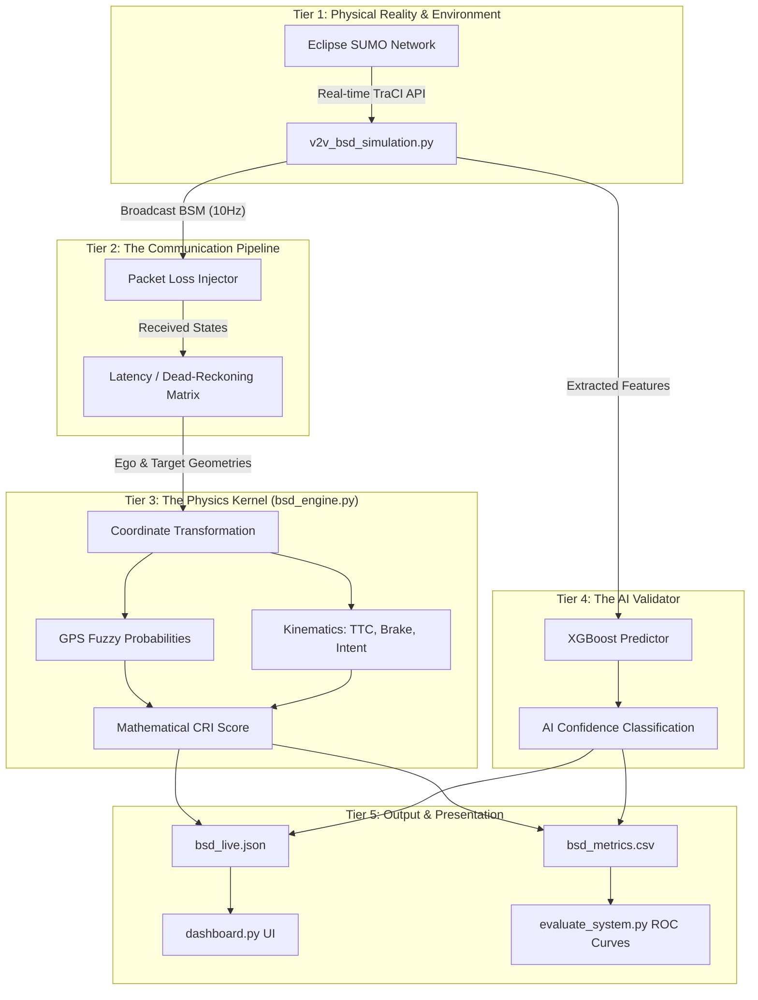

# 🚗 V2V Blind Spot Detection (BSD) System
### *Predictive Physics-Based Collision Risk Analytics with AI-Hybrid Validation*

[](https://sumo.dlr.de/docs/index.html)
[](https://www.python.org/)
[](Mathematical_Model_V2V_BSD.md)
[](AUDIT_REPORT.md)

---

## 🌟 Overview

The **Vehicle-to-Vehicle (V2V) Blind Spot Detection System** is an advanced traffic framework that utilizes Basic Safety Messages (BSM) broadcasted over DSRC/C-V2X channels. Unlike radar/LiDAR equivalents hampered by line-of-sight constraints, this system tracks, computes, and predicts threats *parametrically* using network telemetry.

Powered by the mathematically proven **V3.0 Math Physics Engine**, the system calculates a holistic **Core Risk Index (CRI)** evaluating:
1. Friction-Limited Deceleration Risks ($R_{decel}$)
2. Longitudinal and **Lateral** Time-To-Collision ($R_{ttc}$)
3. Vectorized Target Intent & Steering Drift ($R_{intent}$)
4. GPS Gaussian Probabilities and Network Packet-Loss (Gilbert-Elliott Markov Models)

Simultaneously, the framework pipes raw positional geometries via an integrated **XGBoost AI Hybrid Predictor**, catching complex temporal correlations to generate secondary probability checks (with 99%+ proven accuracy) running fully synchronously on a live interactive dashboard.

---

## 🏗️ System Architecture & Data Flow

The project features a fully decoupled, five-tier pipeline suitable for academic research, SUMO stochastic simulation, and physical ROS2 deployment.



---

## 🚀 Beginner's Deep-Dive Installation Guide

Follow these steps exactly to get everything running seamlessly on your machine.

### Step 1. Prepare Eclipse SUMO (The Traffic Simulator)
This project uses Eclipse SUMO to physically render cars and extract geometric coordinates.
1. Download SUMO from [the official Eclipse website](https://eclipse.dev/sumo/).
2. Install it.
3. **CRITICAL STEP**: Add your SUMO `/bin` folder to your computer's `PATH` Environment Variable.
   - Example path: `C:\Program Files (x86)\Eclipse\Sumo\bin`
4. Set the `SUMO_HOME` environment variable pointing to the root SUMO folder.

### Step 2. Setup the Python Environment
This mathematical engine uses SciPy, Pandas, XGBoost, and Streamlit. You need Python 3.10 or higher.
```bash
# 1. Clone the repository 
git clone https://github.com/your-username/V2V-BSD.git
cd V2V-BSD

# 2. (Optional but Recommended) Create a virtual environment
python -m venv venv
# On Windows:
venv\Scripts\activate
# On Mac/Linux:
source venv/bin/activate

# 3. Install exactly the verified required libraries
pip install -r requirements.txt
```

### Step 3. Launch the Premium Dashboard & Simulation

You need **two terminal windows** open inside the `Scripts/` folder to run the full simulation and visualize it live.

#### Terminal A (Launch the Web UI):
```bash
cd Scripts
streamlit run dashboard.py
```
*Tip: This will open your web browser to `localhost:8501`. Turn OFF "Live Sync" in the sidebar if you want to freeze the dashboard and inspect a specific threat scenario!*

#### Terminal B (Run the Simulation Engine):
```bash
cd Scripts
# To run the simulation Headless (Insane execution Speed):
python v2v_bsd_simulation.py --no-gui --steps 1000

# OR to launch the SUMO Graphic window (Slower, but visually verifiable):
python v2v_bsd_simulation.py --steps 1000

# OR you can use the built-in Master Launcher:
python run.py
```
Once the simulation starts, the Dashboard in Terminal A will instantly wake up, rendering all active blind-spot metrics live!

---

## 📈 Post-Simulation Workflow (Data Analytics)

When your simulation ends, the engine automatically saves 100% of the crash data to an output artifact (`../Outputs/bsd_metrics.csv`). You can then run advanced analytics and train the AI over the new data.

### 1. Evaluate Machine Learning Accuracies vs Mathematical Baselines
```bash
python evaluate_system.py
```
**What this does**: Automatically cross-references Ground Truths (when cars actually collided) against the Mathematical engine and XGBoost alerts. Outputs the AUC (Area Under Curve) and generates a graph (`Outputs/roc_curve.png`) proving system efficacy.

### 2. Calibrate The Physics Kernel Optimal Weights
```bash
python optimize_weights.py
```
**What this does**: Performs a Grid-Search across the generated data. It tests tens of thousands of combinations for $\alpha$ (decel priority), $\beta$ (TTC priority), and $\gamma$ (intent priority) and auto-updates the mathematical weights inside `bsd_engine.py` for maximum F1 accuracy.

### 3. Re-Train The XGBoost AI Engine 
```bash
python train_ai_model.py
```
**What this does**: Exerts the generated features (like `closing_speed`, `target_angle`, `max_gap`) to actively retrain the `xgboost` `.json` payload ensuring the AI constantly adapts to the latest driving habits observed.

### 4. System Stability and Resiliency Profiling
```bash
python ablation_study.py         # Mutates components to prove each feature provides value
python sensitivity_analysis.py   # Crashes the network with 90% Packet Loss to find the breaking point
```

---

## 📂 Project Structure & Ultimate File Directory

Every file has a highly deliberate purpose. There is no bloat.

### 📘 The Academic Core (Root Directory)
| File | Role |
|------|------|
| `Mathematical_Model_V2V_BSD.md` | **The Master Spec**: Exhaustive academic document proving every algebraic formula used by the engine (Curvature corrections, Friction, Dead Reckoning). |
| `Mathematical_Model_Explanation.md` | **The Layman's Translation**: A simplified "Explain Like I'm 10" guide breaking down the rigorous limits into simple concepts. |
| `AUDIT_REPORT.md` | An integrity check log of system validation checks. |
| `requirements.txt` | Python Dependencies list (`xgboost`, `scipy`, `pandas`, `sumolib`, `streamlit`, `plotly`). |

### 📂 External Assets (`Maps/` and `Outputs/`)
| File | Role |
|------|------|
| `atal.net.xml` / `urban_intersection.net.xml` | The physical XML matrices defining the simulated SUMO roads. |
| `/Outputs/bsd_metrics.csv` | Your ultimate generated dataset tracking every single fraction-of-a-second vehicle interaction metric for ML evaluation. |
| `/Outputs/bsd_live.json` | The real-time messaging pipeline linking the SUMO python script to the Streamlit asynchronous front-end UI. |
| `/Outputs/bsd_xgboost_model.json` | The compiled and trained intelligence of the XGBoost Hybrid predictor model. |

### 🧠 The Core Logic Engine (`Scripts/`)
| File | Purpose | Deep-Dive Functionality |
|------|---------|-------------------------|
| `v2v_bsd_simulation.py` | **Master Simulator** | Hooks into SUMO via TraCI. Generates vehicles, forces unpredictable driving scenarios, injects network packet-drops, parses coordinates, triggers math/AI engines, and structures the `Outputs`. |
| `bsd_engine.py` | **Primary Physics Kernel** | The direct python implementation of the V3.0 Math Document. Computes Ego-Centric Matrices, GPS Guassian Probabilities, Relative Kinematics, Time-To-Collision limits, and Target Intent Risk arrays. |
| `dashboard.py` | **Premium Live UI** | An interactive Streamlit "Glassmorphism" interface tracking UDP-like JSON streams. Features Overhead Descartes Maps, Metric Matrices, and Radar Polars. |
| `train_ai_model.py` | **AI Compiler** | Ingests `bsd_metrics.csv`, evaluates spatial angles, and builds the XGBoost classifier artifacts. |
| `evaluate_system.py` | **Performance Benchmark** | Defines Ground-Truth Collision proxies, generates the ROC plot graphics, and reports AUC limits. |
| `optimize_weights.py` | **Model Tuner** | Executes Grid Search to fine-tune the CRI physics coefficient boundaries and rewrite `bsd_engine.py`. |
| `ablation_study.py` | **Stochastic Profiler** | Loops the simulation silently across 5 random seeds while systematically decoupling engine fragments to evaluate empirical survivability variables. |
| `sensitivity_analysis.py` | **Failure Simulator** | Progressively degrades standard constraints (e.g. inflating GPS noise, escalating Gilbert-Elliott packet loss) to mathematically demonstrate environmental failure thresholds. |
| `gen_bridge_routes.py` | **Scenario Spawner** | Bootstraps `.rou.xml` files. Programmatically injects extreme density, aggressive cut-ins, and high-speed blind spot intersections onto the bridge/urban geometry to stress test the collision detection. |
| `scenario_injector.py` | **TraCI Chaos** | Intervenes dynamically inside the live SUMO thread to force cars to perform aggressive swerves and panic braking to generate the chaotic near-miss datasets. |
| `ros2_wgs84_wrapper.py`| **Physical AV Bridge** | Offers a template for integrating `bsd_engine.py` to a real-world autonomous vehicle (ROS2 Stack). Applies Equirectangular Approximation converting real Earth WGS84 geodesics (Lat/Lon) into localized Cartesian grids! |
| `run.py` | **Quick Launcher** | Simple script that initiates the multi-threaded simulation dependencies. |
| `test_engine.py`, `test_cols.py`, `test_label.py` | **Unit Verifications** | Verifies logic limits during code modification. Execute with `python test_engine.py` to secure branch integrity. |
| `update_md.py` | **Doc Sync** | A utility syncing code constants to the README schemas. |

---

## 🛡️ License and Acknowledgements

Developed as a cornerstone framework for Advanced Intelligent Transportation Systems (ITS). 
Designed entirely for extensibility toward Sensor Fusion (combining LiDAR objects directly with extrapolated BSM predictions) and production deployment inside Autoware / Apollo ecosystem stacks.
