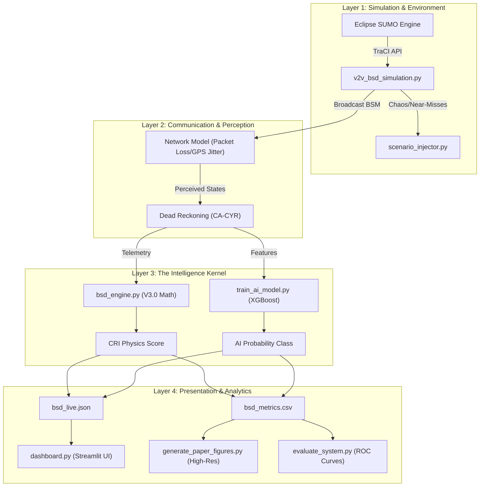

# 🚗 V2V Blind Spot Detection (BSD) System
### *Predictive Physics-Based Collision Risk Analytics with AI-Hybrid Validation*

[](https://sumo.dlr.de/docs/index.html)
[](https://www.python.org/)
[](Mathematical_Model_V2V_BSD.md)
[]()

---

## 🌟 Overview

The **Vehicle-to-Vehicle (V2V) Blind Spot Detection System** is a mathematically rigorous traffic safety framework that utilizes DSRC/C-V2X telemetry to predict and prevent collisions. By processing Basic Safety Messages (BSM) at 10Hz, the system tracks neighboring vehicles even in radar-obstructed or non-line-of-sight (NLOS) scenarios.

### Core Features:
1.  **V3.0 Math Physics Engine**: Implements dynamic blind spot zones with clothoid curvature correction and friction-aware risk scoring.
2.  **CRI (Collision Risk Index)**: A holistic [0,1] score integrating $R_{decel}$ (physics-limit braking), $R_{ttc}$ (longitudinal/lateral collision time), and $R_{intent}$ (steering drift & turn symbols).
3.  **XGBoost Hybrid Predictor**: A parallel AI model that validates mathematical alerts against complex historical simulation data.
4.  **Network Resilience**: Integrated Gilbert-Elliott Markov models to handle bursty packet loss and 1.5m-GPS Gaussian uncertainty.
5.  **Interactive Dashboard**: Premium Streamlit UI for real-time visualization of Descartes coordinates, radar polars, and telemetry matrices.

---

## 🏗️ System Architecture & Data Flow

The project utilizes a decoupled pipeline architecture designed for research reproducibility and modular deployment.



### 🔁 The Data Loop:
1.  **Simulation** generates vehicle interactions and near-misses.
2.  **Telemetry** (BSM) is processed through Gaussian noise and packet loss filters.
3.  **Engine** computes the deterministic Physics risk (Interpretability).
4.  **AI Model** predicts the pattern-based risk (Verification).
5.  **Metrics** are logged for automated weight optimization and figure generation.

---

## 🚀 Installation Guide

Follow these steps to set up the environment and run the complete system.

### Prerequisites:
1.  **Python 3.10+**: [Download here](https://www.python.org/).
2.  **Eclipse SUMO 1.1x+**: [Installation Guide](https://sumo.dlr.de/docs/Installing/index.html).
    - Ensure `SUMO_HOME` is set and `sumo/bin` is in your `PATH`.

### Setup:
```bash
# Clone the repository
git clone https://github.com/your-username/V2V-BSD.git
cd V2V-BSD

# Create and activate virtual environment
python -m venv .venv
# Windows:
.venv\Scripts\activate
# Mac/Linux:
source .venv/bin/activate

# Install dependencies
pip install -r requirements.txt
```

---

## 🛠️ Usage Instructions

### 1. Launch the Live Dashboard (Terminal 1)
Prepares the UI to receive real-time telemetry streams.
```bash
cd Scripts
streamlit run dashboard.py
```

### 2. Initiate the Simulation (Terminal 2)
The simulation is highly configurable via CLI arguments.
```bash
cd Scripts
# Fast Headless Run (Recommended for data collection)
python v2v_bsd_simulation.py --no-gui --steps 3600

# GUI Mode (Visual demonstration)
python v2v_bsd_simulation.py --steps 1000 --gui
```

### 3. Generate Research Artifacts
Once the simulation finishes, use these tools to generate publication-ready data.
```bash
# Generate high-resolution figures for report/paper
python generate_paper_figures.py

# Calculate ROC curves and AUC performance
python evaluate_system.py

# Conduct a multi-seed ablation study
python ablation_study.py
```

---

## 📂 Project Directory & File Guide

### 📂 Core Infrastructure
| File | Role |
|------|------|
| `Mathematical_Model_V2V_BSD.md` | **The Master Spec**: Defines the V3.0 physics formulas, weights, and logic. |
| `bsd_engine.py` | **The Math Kernel**: Python implementation of Section 8 of the spec. |
| `bsd_utils.py` | **Utility Core**: Centralized ground-truth and near-miss proxy definitions. |
| `v2v_bsd_simulation.py` | **Main Loop**: Handles TraCI hooks, BSM emission, and CSV logging. |

### 📂 Analysis & Advanced Research
| File | Purpose |
|------|---------|
| `train_ai_model.py` | Pipeline for feature engineering and XGBoost training. |
| `optimize_weights.py` | Grid-search tool to auto-calibrate CRI weights ($\alpha, \beta, \gamma$). |
| `generate_paper_figures.py` | Produces fig1_roc.png, fig2_importance.png, etc. in 300 DPI. |
| `sensitivity_analysis.py` | Tests system resilience against GPS noise and packet loss thresholds. |
| `ablation_study.py` | Validates that each math component contributes to overall F1 accuracy. |

### 📂 Scenario & Data Generation
| File | Purpose |
|------|---------|
| `scenario_injector.py` | Injects aggressive swerving and lane-cut behaviors into SUMO. |
| `gen_bridge_routes.py` | Programmatically generates high-density route files for the bridge map. |
| `ros2_wgs84_wrapper.py` | Bridge for real-world Lat/Lon (WGS84) to Cartesian coordinate conversion. |

---

## 📈 Integration & Data Integrity
The system is built on a **Single Source of Truth** architecture:
- Ground-truth logic is centralized in `bsd_utils.py` so that AI training and Physics evaluation always use the same collision proxies.
- Parameters are defined in the `Params` class in `bsd_engine.py`, which is mirrored by the `Mathematical_Model_V2V_BSD.md` documentation.

---

## 📜 License
This project is designed for open-source research and academic publication. Every algorithm is fully transparent and derived in the provided mathematical documentation.
