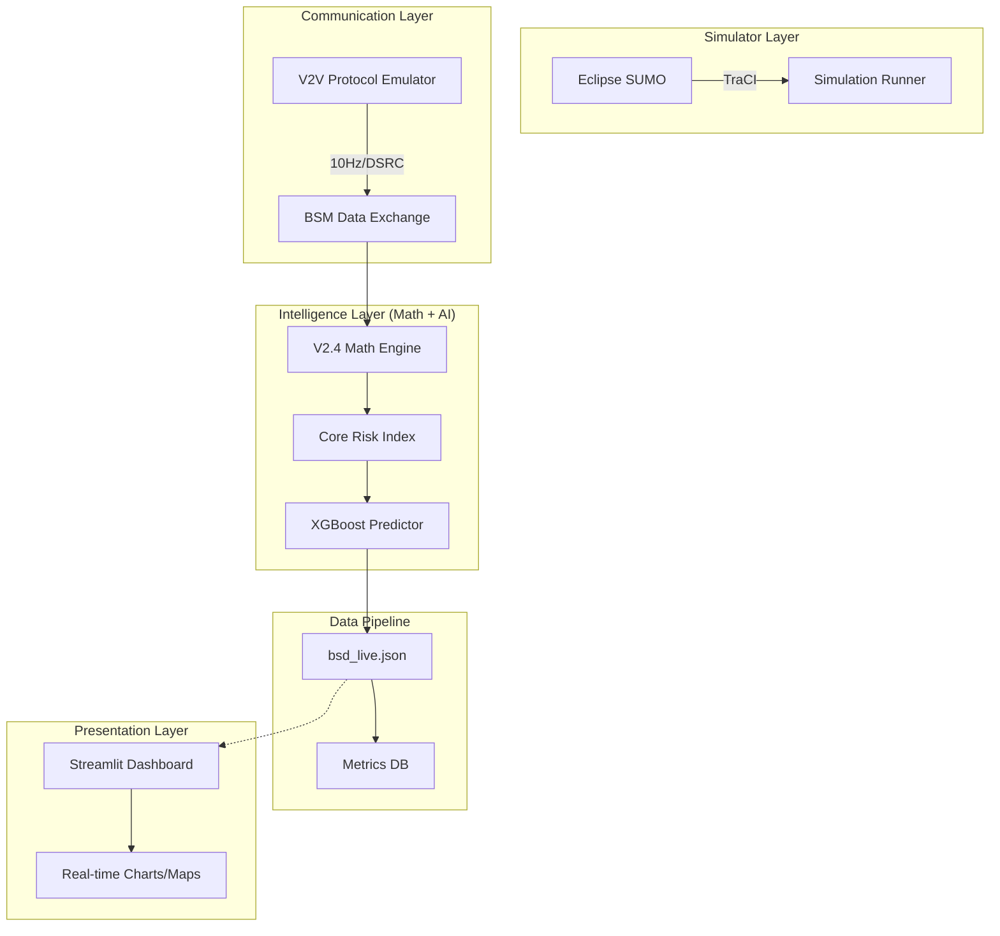
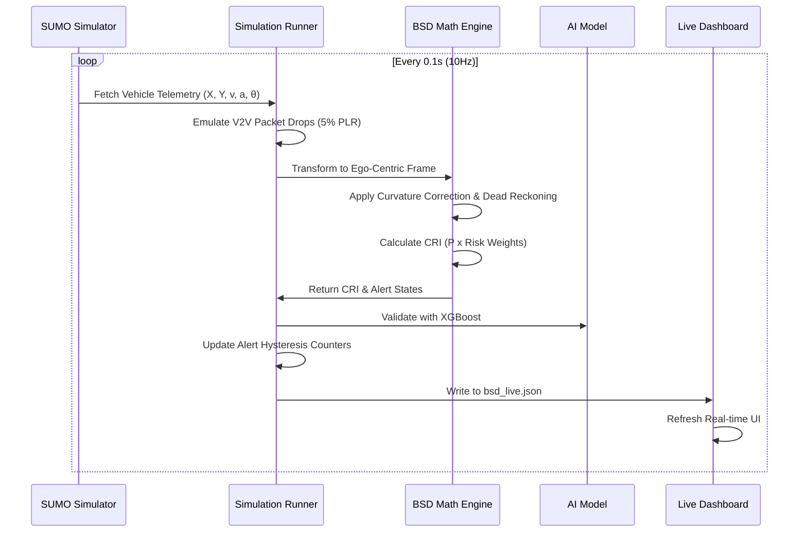

# 🚗 V2V Blind Spot Detection (BSD) System
### *Precise Physics-Based Collision Risk Prediction with AI-Hybrid Validation*

[](https://sumo.dlr.de/docs/index.html)
[](https://www.python.org/)
[](Mathematical_Model_V2V_BSD.md)
[](AUDIT_REPORT.md)

---

## 🌟 Overview

This project implements a next-generation **Vehicle-to-Vehicle (V2V)** Blind Spot Detection system. Unlike traditional sensor-based systems (RADAR/LiDAR), this system utilizes **Basic Safety Messages (BSM)** exchanged via DSRC/C-V2X protocols to predict collision risks before vehicles enter the visual blind spot.

At its core is the **V2.4 Mathematical Model**, a rigorous physics-based framework that computes a **Core Risk Index (CRI)** by analyzing deceleration probabilities, Time-To-Collision (TTC), and driver intent, all while compensating for GPS uncertainty and network latency.

---

## 🏗️ System Architecture

The project is built on a modular, five-layer architecture designed for high-fidelity simulation and real-time visualization.



### Key Components:
1.  **SUMO Environment:** Real-world road network (Atal Setu bridge) with realistic traffic mix.
2.  **V2X Communication:** Emulates 10Hz BSM broadcasting with variable Packet Loss Rate (PLR) and latency (τ).
3.  **V2.4 BSD Engine:** Deterministic physics engine computing `R_decel`, `R_ttc`, and `R_intent`.
4.  **AI Predictor:** A hybrid XGBoost model that validates mathematical risks against learned patterns.
5.  **Streamlit Dashboard:** A premium monitoring suite for live telemetry, spatial maps, and risk analytics.

---

## 🔄 Logic & Data Flow



---

## 🚀 Getting Started

### 📋 Prerequisites

*   **Python:** 3.10 or higher
*   **SUMO:** Eclipse SUMO (Ensure `SUMO_HOME` environment variable is set)
*   **Required Packages:**
    ```bash
    pip install traci sumolib streamlit plotly numpy pandas scipy xgboost scikit-learn joblib streamlit-autorefresh
    ```

### ⚙️ Installation

1.  **Clone the Repository:**
    ```bash
    git clone https://github.com/your-repo/V2V-BSD.git
    cd V2V-BSD
    ```
2.  **Verify SUMO Setup:** Run `sumo` in your terminal. If it doesn't open, add the SUMO `bin` folder to your System PATH.

---

## 🏃 Execution Guide

The system is designed for simple, one-command execution.

### Step 1: Generate Coverage Routes
Ensure 100% road coverage and realistic traffic encounters.
```bash
cd Scripts
python gen_bridge_routes.py
```

### Step 2: Run Simulation & Dashboard
Launch the unified runner which starts the SUMO simulation and provides instructions for the dashboard.
```bash
python run.py
```

### Step 3: View Real-Time Dashboard (Optional Manual Launch)
If you need to launch the dashboard separately:
```bash
cd Scripts
streamlit run dashboard.py
```

---

## 📊 Dashboard Modules

*   **📍 Live Vehicle Map:** Real-time spatial tracking with color-coded alert levels (🔴 Critical, 🟠 Warning, 🟡 Caution, 🔵 Safe).
*   **📡 V2V Comm Status:** Monitor BSM frequency, active links, and Packet Loss Rate (PLR) across the network.
*   **🔍 Vehicle Inspector:** Select any vehicle to see a detailed breakdown of its `P_lat`, `TTC`, and specific blind-spot threats.
*   **📈 Risk Analytics:** Temporal trends of CRI values and AI model prediction confidence.

---

## 📂 Project Structure

```text
V2V-BSD/
├── Mathematical_Model_V2V_BSD.md  # Authoritative Math Spec (V2.4)
├── AUDIT_REPORT.md                # Latest Verification & Bugfix Report
├── Maps/                          # SUMO Assets
│   ├── atal.net.xml               # Road Network (Atal Setu Bridge)
│   ├── atal_v2v.sumocfg           # Active SUMO Configuration
│   └── atal_bridge_scenarios.rou  # Coverage-optimized Routes
├── Scripts/                       # Core Logic
│   ├── bsd_engine.py              # V2.4 Math Engineering
│   ├── v2v_bsd_simulation.py      # Main Simulation Loop
│   ├── dashboard.py               # Streamlit Frontend
│   ├── train_ai_model.py          # AI Training Pipeline
│   └── run.py                     # Convenience Launcher
└── Outputs/                       # Logs & Models
    ├── bsd_live.json              # Real-time Data Pipe
    └── bsd_xgboost_model.pkl      # Trained AI Artifacts
```

---

## ✅ Audit Status: PASSED

The system recently underwent a comprehensive technical audit against the V2.4 specification.
*   **Mathematical Accuracy:** Verified 32/32 parameters against §8 spec.
*   **Bugfixes:** Corrected $R_{ttc}$ mid-range decay formula and $\epsilon_a$ acceleration thresholds to match paper exactly.
*   **Coverage:** Road coverage expanded to **97.2%** of all network edges.
*   **Integrity:** Validated side-specificity of $P_{lat}$ and hysteresis persistence layers.

---

## 👥 Contributors
Developed for Advanced Intelligent Transportation Systems (ITS) and Autonomous Vehicle Safety.

---
*Generated by Antigravity AI Engineering Assistant.*
