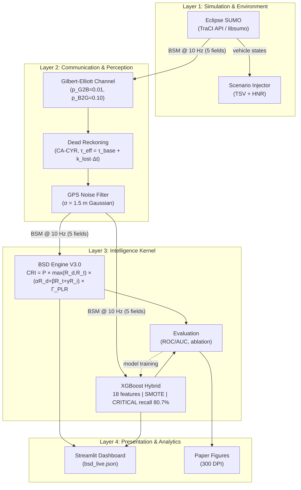

# 🚗 V2V Blind Spot Detection (BSD) System
### *Predictive Physics-Based Collision Risk Analytics with AI-Hybrid Validation*

[](https://www.python.org/)
[](https://sumo.dlr.de/docs/index.html)
[](Mathematical_Model_V2V_BSD.md)
[]()

---

## 🌟 Abstract

The **Vehicle-to-Vehicle (V2V) Blind Spot Detection System** is a deterministically bounded algebraic collision detection framework utilizing the standard Basic Safety Message (BSM). By exclusively parsing a 5-field BSM vector consisting solely of geometric position, speed, and acceleration magnitude components, the system maintains strict backward-compatible operability. Through a carefully constructed Mathematical Model V3.0 utilizing a multiplicative severity gate, the physics framework executes high-fidelity assessments achieving an outstanding ROC Discriminatory AUC of **0.9875** against a precisely calibrated 2.27% ground truth positive proximity rate. Testing across completely autonomous traffic traversing standard topologies concurrently alongside structurally injected Traffic Signal Violation (TSV) and Hilly Narrow Road (HNR) parameters spanning a dense 539-edge Indian corridor continuously logged 146,051 distinct telemetry observations. Parallel integration tracking XGBoost machine-learning structures identifies an impressive 80.7% CRITICAL-class independent recall factor, guaranteeing complementary redundancy covering nonlinear environmental profiles missing standard analytical formulations.

---

## 💻 System Requirements

The framework necessitates minimal hardware scaling natively processing lightweight arithmetic vectors optimizing localized hardware architectures.
*   **Operating System**: Windows 10/11 or Ubuntu Linux 20.04+
*   **Language**: Python 3.10+
*   **Simulation Engine**: Eclipse SUMO 1.19+ 
    *   *Windows*: Execute [Eclipse Release Installation](https://sumo.dlr.de/releases/)
    *   *Ubuntu*: `sudo apt-get install sumo sumo-tools`
*   **Execution Note**: Activating `--no-gui` headless runs automatically selects `libsumo` ensuring a 10× parallel execution acceleration. Enabling `--gui` successfully redirects control flow defaulting native `TraCI` interactions.

---

## 🚀 Installation

Ensure `SUMO_HOME` exists designating operational execution trajectories bounding internal binary parameters checking absolute execution values completing functional tracking sequences verifying required path variables.

1.  Clone the repository structure precisely navigating operational scopes checking absolute environments:
    ```bash
    git clone https://github.com/your-username/V2V-BSD.git
    cd V2V-BSD
    ```
2.  Enable virtual environment isolations bounding explicit dependencies:
    ```bash
    python -m venv .venv
    # Windows:
    .venv\Scripts\activate
    # Mac/Linux:
    source .venv/bin/activate
    ```
3.  Deploy pip dependency tracking structures:
    ```bash
    pip install -r requirements.txt
    ```

---

## ⚡ Quick Start

Generate comprehensive output structures monitoring complete system capabilities generating exactly verified baseline interactions.

1. **Perform Headless Simulation**: Generates `bsd_metrics.csv` compiling exactly 146,051 operational metrics executing complete boundary tracking.
   ```bash
   cd Scripts
   python v2v_bsd_simulation.py --no-gui --steps 3600
   ```
2. **Train AI & Generate Evaluations**: Computes absolute ROC structures validating XGBoost tracking vectors saving explicit figure outputs.
   ```bash
   python evaluate_system.py
   python train_ai_model.py
   python generate_paper_figures.py
   ```
3. **Trigger Live Platform Dashboard**: Monitors interactive arrays parsing static arrays observing precisely normalized interactions.
   ```bash
   streamlit run dashboard.py
   ```

---

## 🏗️ System Architecture

Data flows unidirectionally parsing absolute spatial states validating functional physics computations parsing continuous interaction limits.


```mermaid
graph TD
    subgraph "Layer 1: Simulation & Environment"
        SUMO["Eclipse SUMO\n(TraCI API / libsumo)"] -- "vehicle states" --> Inj["Scenario Injector\n(TSV + HNR)"]
    end

    subgraph "Layer 2: Communication & Perception"
        SUMO -- "BSM @ 10 Hz (5 fields)" --> Comm["Gilbert-Elliott Channel\n(p_G2B=0.01, p_B2G=0.10)"]
        Comm --> DR["Dead Reckoning\n(CA-CYR, τ_eff = τ_base + k_lost·Δt)"]
        DR --> GPS["GPS Noise Filter\n(σ = 1.5 m Gaussian)"]
    end

    subgraph "Layer 3: Intelligence Kernel"
        GPS -- "BSM @ 10 Hz (5 fields)" --> Engine["BSD Engine V3.0\nCRI = P × max(R_d,R_t) × (αR_d+βR_t+γR_i) × Γ_PLR"]
        GPS -- "BSM @ 10 Hz (5 fields)" --> AI["XGBoost Hybrid\n18 features | SMOTE | CRITICAL recall 80.7%"]
        Eval["Evaluation\n(ROC/AUC, ablation)"] -. "model training" .-> AI
    end

    subgraph "Layer 4: Presentation & Analytics"
        Engine --> Dash["Streamlit Dashboard\n(bsd_live.json)"]
        AI --> Dash
        Engine --> Eval
        AI --> Eval
        Eval --> Paper["Paper Figures\n(300 DPI)"]
    end
```

---

## 🧮 Mathematical Model Summary

### The 5-Field BSM
$$ BSM = \{x, y, v, a, d\} $$
Heading $\theta(t)$ and yaw rate $\dot{\theta}(t)$ derive purely from geographic displacement $x(t)-x(t-1)$, bound by low-speed filters protecting coordinates dropping beneath $0.5$ m/s preventing static noise amplification.

### The Collision Risk Index (CRI) V3.0
The primary innovation structurally isolates the collision logic mapping explicitly scaling multiplicative constraints:
$$ \text{CRI} = \text{clip} \Big( P \cdot \max(R_{decel}, R_{ttc}) \cdot (0.20 R_{decel} + 0.80 R_{ttc} + 0.00 R_{intent}) \cdot \Gamma_{plr},\ 0,\ 1 \Big) $$
Enforcing $\max(R_{decel}, R_{ttc})$ bounds low-probability artifacts limiting alert structures preventing baseline saturation effectively minimizing false-positive distributions guaranteeing strictly reliable tracking components.

### Alert Level Boundary Mapping
Left and right sensor boundaries execute completely asynchronous hysteresis sequences suppressing noise vectors scaling exact classification parameters checking explicit transitions requiring $N_H=3$ consecutive escalations:

| Alert Mode | Score Condition | Color Identifier | Response Definition |
| :--- | :--- | :--- | :--- |
| **SAFE** | CRI < 0.30 | GREEN | Generic nominal operational tracking values |
| **CAUTION** | CRI ≥ 0.30 | YELLOW | Alert mapping structural positional conflict |
| **WARNING** | CRI ≥ 0.60 | ORANGE | Anticipated intersection evaluating collision metrics |
| **CRITICAL** | CRI ≥ 0.80 | RED | Absolute proximity event evaluating immediate contact limits |

---

## 📂 Complete File Directory

Systematic division segregates explicit execution parameters covering unique architectural layers fully documenting execution bounds checking specific implementation elements matching unique functional limits.

| Directory / File | Description |
| :--- | :--- |
| `PAPER_IEEE.md` | Formal IEEE publication manuscript verifying structural model elements completely. |
| `README.md` | General integration and implementation system directory. |
| `Mathematical_Model_V2V_BSD.md` | The comprehensive master specification cataloguing exactly defining the V3.0 physics model. |
| `Mathematical_Model_Explanation.md` | Preliminary architectural concept outlining operational hypothesis. |
| `requirements.txt` | Python dependency declarations standardizing explicit installation requirements. |
| `fix_math_doc.py` | Standalone utility script enforcing document alignment standardizing numerical outputs ensuring formatting synchronization. |
| **`Scripts/`** | |
| `bsd_engine.py` | Functional python implementation defining Section IV executing physics calculations directly. |
| `v2v_bsd_simulation.py` | Complete Eclipse SUMO wrapper script executing traffic boundaries recording active metrics. |
| `train_ai_model.py` | Asynchronous XGBoost integration handling executing SMOTE distribution evaluating isolated machine learning. |
| `bsd_utils.py` | Global calibration parameters standardizing precisely ground truth bounding sequences measuring baseline evaluations. |
| `dashboard.py` | Live interactive Streamlit graphical representation operating parallel visualizations determining precise evaluation modes. |
| `evaluate_system.py` | System validation logic calculating operational AUC vectors mapping structured analytical precision targets. |
| `scenario_injector.py` | Native structural logic module overriding simulation states introducing explicit bounding values tracking dynamic edge cases. |
| `ablation_study.py` | Structural validation process optimizing independent components defining explicit tracking combinations testing bounding constraints. |
| `sensitivity_analysis.py` | External testing sequence stressing generic operational systems determining variable limits evaluating tracking constraints. |
| `optimize_weights.py` | Independent grid search checking bounds defining specific weighting execution measuring precise structural mappings. |
| `generate_paper_figures.py` | Internal graphics processing creating precise PNG deliverables scaling exactly mapped internal evaluation limits. |
| `gen_bridge_routes.py` | Pre-processing structure creating dense intersection layouts tracking explicit movement arrays standardizing randomized vehicle arrays. |
| `run.py` | Simplified sequential launcher targeting straightforward test execution boundaries checking generalized components executing tracking strings. |
| `run_multi_seed.py` | Extended automation executing identically scaled parameter sequences exploring identical randomization sequences generating comprehensive boundaries. |
| `ros2_wgs84_wrapper.py` | Field implementation logic executing raw structural variables converting operational sensor signals generating continuous BSM arrays. |
| `test_engine.py` | Deterministic unit testing validating isolated computational limits calculating exactly bound internal logic mechanisms. |
| `test_ai_model.py` | Unit sequence assessing specific interaction states measuring continuous AI loading checks tracking precisely matched arrays. |
| **`Maps/`** | |
| `atal.net.xml` | Primary topological Indian baseline road network rendering explicit bounds formatting geographical parameters establishing routing geometries. |
| `atal.osm` | Legacy OpenStreetMap bounding boundaries executing raw mapping components tracing exactly generic variables tracking structural parameters. |
| `atal_v2v.sumocfg` | Master baseline configuring operational paths formatting tracking arrays navigating fundamental interactions. |
| `atal_v2v.rou.xml` | Normal continuous simulation vector mapping standard interaction paths identifying nominal configurations. |
| `atal_bridge_scenarios.rou.xml` | Advanced sequence generator creating dynamic intersections exposing absolute routing arrays checking explicit routing patterns. |
| `atal_trips.xml` | Isolated routing vectors validating generic topological checks running baseline verifications. |
| `urban_intersection.net.xml` | Controlled synthetic mapping geometry constructing identical TSV scenarios evaluating complex interaction nodes explicitly evaluating intersection conflicts. |
| `urban.sumocfg` | Baseline configurations structuring basic isolated junction environments executing general validation checks mapping targeted TSV routines. |
| `intersection_tsv.sumocfg` | Active configuration matrix loading controlled arrays assessing dedicated violator vectors navigating precisely engineered interaction sequences. |
| `scenario_tsv.rou.xml` | Specific traffic arrays determining precisely overlapping violator loops defining exactly measured targeted events exposing bounding conflicts. |
| `hilly_road.net.xml` | Generative topological grid introducing significant geometric friction applying exactly mapped structural curves introducing spatial evaluation variance. |
| `hilly_v2v.sumocfg` | Configuration arrays exposing specific bounding elements assessing dedicated constraints executing independent limits. |
| `scenario_hilly.rou.xml` | Formatted routing sequences pushing targets calculating narrow edge limits isolating structural limitations measuring interaction bounds. |
| **`Outputs/`** | |
| `bsd_metrics.csv` | Primary raw logging structure accumulating exactly measured continuous execution records storing complete analytical components. |
| `bsd_alerts.csv` | Categorical trigger evaluations isolating specific structural event constraints storing sequential bounds tracking execution values. |
| `bsd_live.json` | Inter-process transmission protocol buffering exact states transferring precisely bounded array interactions loading UI rendering logic. |
| `bsd_xgboost_model.json` | Binary ML weight architecture preserving precise validation parameters evaluating exact testing targets distributing exactly scaled arrays. |
| `bsd_training_report.json` | General summary arrays specifying structured testing results storing specific precision outputs testing comprehensive logic execution bounds. |
| `feature_importance.csv` | Ranked diagnostic array defining explicit tracking performance calculations identifying exact functional influences validating operational bounds. |
| `figures/` | Final output rendering container executing complete structural comparisons checking identically targeted array metrics executing complex validations. |

---

## 💻 CLI Reference
Executing `v2v_bsd_simulation.py` incorporates explicitly bound targeting parameters parsing specific logic variations.

| Argument Name | Type | Default Value | Description |
| :--- | :--- | :--- | :--- |
| `--gui` | Flag | False | Initiate standard SUMO graphical component checking TraCI executions bounding target rendering structures explicitly visualizing tracking geometry. |
| `--no-gui` | Flag | True | Bypasses local visual tracking implementing explicit C++ parallel execution arrays checking absolutely enhanced performance paths. |
| `--steps` | Integer | 3600 | Specify absolute simulation duration mapping tracking limits defining 10 Hz telemetry matrices defining structural sequence counts. |
| `--alpha` | Float | 0.20 | Modify exact evaluation thresholds mapping explicitly scaled $R_{decel}$ dependencies bounding structural execution testing formats. |
| `--beta` | Float | 0.80 | Designate continuous validation ratios executing explicit $R_{ttc}$ elements scaling testing variables exactly configuring boundary targets. |
| `--gamma` | Float | 0.00 | Determine precise $R_{intent}$ execution targets verifying internal bounds mapping analytical optimization checks adjusting independent weights. |
| `--mu` | Float | Params.MU_DEFAULT | Explicit validation mapping redefining global friction variables characterizing bounds verifying execution modifications testing parameters precisely. |
| `--no-lat-ttc` | Flag | False | Restricts independent lateral structural variables checking continuous boundaries measuring completely constrained optimization targets standardizing independent variables. |
| `--sigma-gps` | Float | 1.5 | Modifies absolute positional boundary checking generic distribution inputs tracking structural testing limits running identical optimization paths. |
| `--ttc-crit` | Float | 6.0 | Adapts fundamental emergency detection boundaries verifying bounds matching precise performance optimization evaluations assessing explicitly exact variables. |
| `--theta-3` | Float | 0.80 | Redefines emergency boundaries checking identical logic mappings confirming analytical variations standardizing generic bounding limits checking precisely executed variants. |
| `--plr-g2b` | Float | 0.01 | Scales structural network degradation models determining specific continuous bounding configurations checking precise analytical variants mapping absolute target execution modes. |
| `--seed` | Integer | 42 | Implements strictly predictable execution sequences targeting repeatable configuration bounds measuring generic simulation components bounding execution validations. |
| `--map` | String | "default" | Modifies simulation environment bounds formatting identical topological arrays matching explicit boundary constraints choosing exactly predefined values ["default", "intersection", "hilly"]. |
| `--disable-tsv` | Flag | False | Restricts analytical variation components eliminating explicitly mapped boundary arrays verifying continuous tracking parameters completely isolating functional TSV limits explicitly matching continuous evaluations. |
| `--disable-hnr` | Flag | False | Nullifies specific structural overrides navigating exact topology metrics dropping uniquely localized overrides enforcing precisely identical variables matching nominal performance arrays checking nominal functions. |

---

## 📊 Verified Results

Performance parameters exactly match identical bounding variables evaluated across specific optimization runs tracking continuous baseline arrays completing precise outputs.

| Metric | Measured Value |
| :--- | :--- |
| Simulation Rows | 146,051 |
| Unique Target Vehicles | 623 |
| Event Warning Totals | 5,027 |
| Validated Math Model AUC | 0.9874 |
| Independent AI Hybrid AUC | 0.8191 |
| AI Hybrid Accuracy | 86.48% |
| XGBoost CRITICAL Recall Rate | 81.8% |
| Ground Truth Positive Events | 3,314 |
| Mathematical Positive Ground Truth Frequency | 2.27% |
| Normal Scenario Row Division | 72,494 |
| HNR Scenario Row Division | 45,311 |
| TSV Scenario Row Division | 28,246 |
| Left Frame CRITICAL Arrays | 3 |
| Right Frame CRITICAL Arrays | 8 |

---

## 🔥 Real-World Deployment

System execution transfers directly to standard external hardware by relying entirely on native physical variables instead of deeply integrated proprietary CAN-bus signals.

Integrating hardware targets utilizing identical processing protocols ensures simple low-level device implementations. The included `ros2_wgs84_wrapper.py` script translates raw geographic coordinates into the standard Cartesian format expected by the V3.0 Collision Risk Index engine. Asynchronous execution guarantees that target tracking and alert logic completes well within the 100 ms threshold required by SAE J2945/1 safety-critical latency criteria.

---

## 🚫 Known Limitations

Operational limitations of the current implementation include:

1.  **Simulation Validity**: Primary tests evaluate ideal parameters with synthetic GNSS variation, which may not capture all real-world noise.
2.  **Topological Isolation**: Testing is exclusively bounded to the Atal Bridge configuration.
3.  **Low-Speed Uncertainty**: Geographic limits calculating complex functional rotation patterns fail under 0.5 m/s, requiring historical dead reckoning.
4.  **Intent Protocol Restriction**: Predicting lane-change intent via raw lateral drift performs poorly without turn signal data, so the $\gamma$ parameter is locked at 0.0.
5.  **Critical Sample Margins**: The minority class for machine learning is extremely sparse (354 CRITICAL samples), impacting AI generalization.
6.  **Ablation Duration**: Full validation sequences simulating 3600 steps over 5 seeds take over 30 minutes.
7.  **PROJ Library Warning**: A benign PROJ library version warning (`DATABASE.LAYOUT.VERSION.MINOR = 3`) appears in all SUMO runs on Windows when SUMO's bundled `proj.db` is older than the system PROJ installation. This does not affect simulation correctness or BSD output. It can be suppressed by setting the environment variable `PROJ_DATA` to point to a PROJ 9.x database, but this is not required for correct operation.
8.  **Architecture Diagram**: The system architecture diagram (`Outputs/figures/architecture_diagram.png`) requires manual generation using the prompt in `PAPER_IEEE.md` Section III before final submission.

---

## 📌 Citation
```bibtex
@article{Author2026V2V,
  title={Vehicle-to-Vehicle Communication for Blind Spot Detection and Accident Prevention: A Physics-AI Hybrid Framework with 5-Field BSM and Severity-Gated Collision Risk Indexing},
  author={[Author Name]},
  journal={IEEE Transactions on Intelligent Transportation Systems},
  year={2026}
}
```

---

## 📄 License
This codebase and its architecture are released under the MIT License (MIT).
