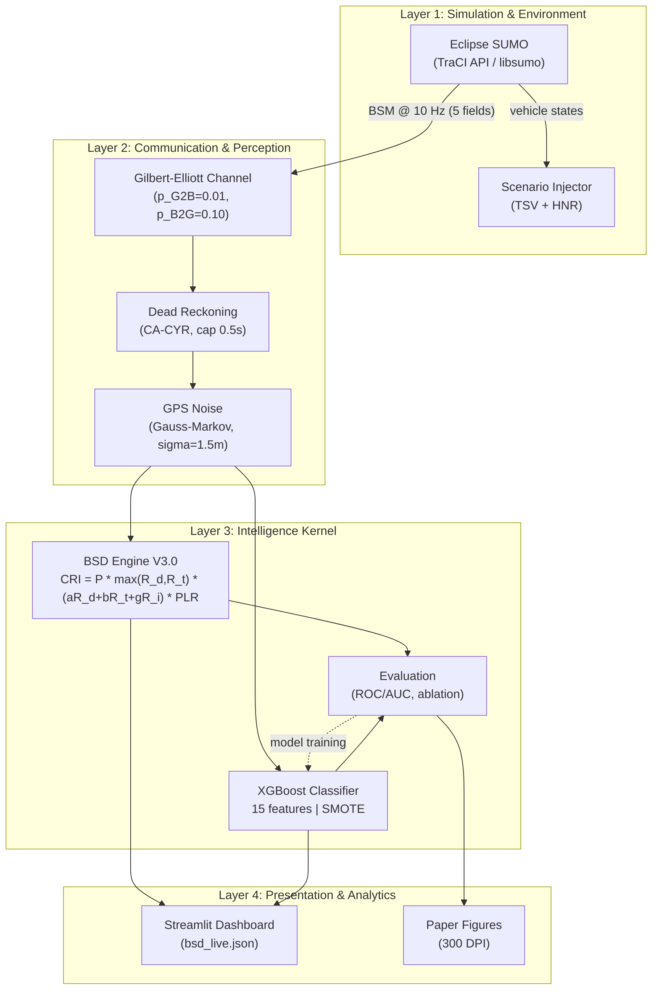

# V2V Blind Spot Detection (BSD) System

**A Physics-AI Hybrid Framework for Cooperative Blind Spot Risk Assessment**

[](https://www.python.org/)
[](https://sumo.dlr.de/docs/index.html)
[](Mathematical_Model_V2V_BSD.md)

---

## Abstract

This project implements a Vehicle-to-Vehicle (V2V) Blind Spot Detection system that uses only 5 fields from the SAE J2735 Basic Safety Message (BSM): position (x, y), speed, acceleration, and deceleration. The core physics engine computes a Collision Risk Index (CRI) using a multiplicative severity gate that suppresses false-positive accumulation from low-magnitude noise.

The system was validated over 146,051 vehicle-pair observations on a 539-edge Atal Bridge road network (Navi Mumbai, India) using Eclipse SUMO, with injected Traffic Signal Violation (TSV) and Hilly Narrow Road (HNR) conflict scenarios. The physics model achieves an AUC of 0.9869 against a kinematic near-miss ground truth (2.37% positive rate, 3,465 events). A complementary XGBoost classifier provides pattern-based backup detection for CAUTION and WARNING events.

---

## System Requirements

- **Operating System**: Windows 10/11 or Ubuntu Linux 20.04+
- **Language**: Python 3.10+
- **Simulation Engine**: Eclipse SUMO 1.19+ (published results generated with sumolib 1.26.0)
  - *Windows*: Download from [Eclipse SUMO Releases](https://sumo.dlr.de/releases/)
  - *Ubuntu*: `sudo apt-get install sumo sumo-tools`
- **Environment Variable**: `SUMO_HOME` must point to your SUMO installation directory.
- **GUI vs Headless**: Use `--no-gui` for headless mode (uses `libsumo`, significantly faster). Use `--gui` for the SUMO graphical interface (uses `TraCI`).
- **Random Seed**: Default seed is 42 (configurable via `--seed`). All published results use seed 42.

---

## Installation

1. Clone the repository:
    ```bash
    git clone <repository-url>
    cd V2V-BSD
    ```
2. Create and activate a virtual environment:
    ```bash
    python -m venv .venv
    # Windows:
    .venv\Scripts\activate
    # Mac/Linux:
    source .venv/bin/activate
    ```
3. Install dependencies:
    ```bash
    pip install -r requirements.txt
    ```

---

## Quick Start

1. **Run the simulation** (generates `Outputs/bsd_metrics.csv` with 146,051 rows):
   ```bash
   cd Scripts
   python v2v_bsd_simulation.py --no-gui --steps 3600
   ```
2. **Evaluate and train the AI model**:
   ```bash
   python evaluate_system.py
   python train_ai_model.py
   python generate_paper_figures.py
   ```
3. **Launch the dashboard**:
   ```bash
   streamlit run dashboard.py
   ```

---

## System Architecture


```mermaid
graph TD
    subgraph "Layer 1: Simulation & Environment"
        SUMO["Eclipse SUMO\n(TraCI API / libsumo)"] -- "vehicle states" --> Inj["Scenario Injector\n(TSV + HNR)"]
    end

    subgraph "Layer 2: Communication & Perception"
        SUMO -- "BSM @ 10 Hz (5 fields)" --> Comm["Gilbert-Elliott Channel\n(p_G2B=0.01, p_B2G=0.10)"]
        Comm --> DR["Dead Reckoning\n(CA-CYR, cap 0.5s)"]
        DR --> GPS["GPS Noise\n(Gauss-Markov, sigma=1.5m)"]
    end

    subgraph "Layer 3: Intelligence Kernel"
        GPS --> Engine["BSD Engine V3.0\nCRI = P * max(R_d,R_t) * (aR_d+bR_t+gR_i) * PLR"]
        GPS --> AI["XGBoost Classifier\n15 features | SMOTE"]
        Eval["Evaluation\n(ROC/AUC, ablation)"] -. "model training" .-> AI
    end

    subgraph "Layer 4: Presentation & Analytics"
        Engine --> Dash["Streamlit Dashboard\n(bsd_live.json)"]
        AI --> Dash
        Engine --> Eval
        AI --> Eval
        Eval --> Paper["Paper Figures\n(300 DPI)"]
    end
```

---

## Mathematical Model Summary

### 5-Field BSM Input

$$BSM = \{x, y, v, a, d\}$$

Heading and yaw rate are derived from consecutive position history. A low-speed guard holds the last known heading when velocity drops below 0.5 m/s to prevent GPS jitter from corrupting angle estimates.

### Collision Risk Index (CRI) V3.0

$$\text{CRI} = \text{clip}\Big(P \cdot \max(R_{\text{decel}}, R_{\text{ttc}}) \cdot (\alpha R_{\text{decel}} + \beta R_{\text{ttc}} + \gamma R_{\text{intent}}) \cdot \Gamma_{\text{plr}},\ 0,\ 1\Big)$$

The `max(R_decel, R_ttc)` severity gate requires at least one physical risk dimension to reach a dangerous level before the composite index can escalate, preventing false-positive accumulation from compounded low-magnitude noise. Optimized weights: alpha=0.20, beta=0.80, gamma=0.00.

### Alert Levels

Left and right blind spot zones are scored independently. Alert upgrades require 3 consecutive steps at the higher level (hysteresis); downgrades require CRI to drop below the threshold minus a δ_h=0.05 band to prevent oscillation near boundaries.

| Level | CRI Threshold | Meaning |
| :--- | :--- | :--- |
| **SAFE** | < 0.30 | No significant risk detected |
| **CAUTION** | >= 0.30 | Target present in blind spot zone |
| **WARNING** | >= 0.60 | Closing trajectory with limited stopping margin |
| **CRITICAL** | >= 0.80 | Imminent collision risk, immediate action required |

---

## File Directory

| Path | Description |
| :--- | :--- |
| **`Scripts/`** | |
| `bsd_engine.py` | Core V3.0 physics engine: coordinate transform, zone probability, risk components, CRI computation |
| `v2v_bsd_simulation.py` | SUMO simulation wrapper: runs TraCI/libsumo loop, applies channel model, logs metrics |
| `train_ai_model.py` | XGBoost training pipeline with SMOTE oversampling and TimeSeriesSplit cross-validation |
| `bsd_utils.py` | Shared utilities: ground truth definition, threshold constants |
| `dashboard.py` | Streamlit real-time dashboard with live tracking and historical replay modes |
| `evaluate_system.py` | ROC/AUC computation and baseline comparisons |
| `scenario_injector.py` | TSV and HNR conflict scenario injection during simulation |
| `ablation_study.py` | Full ablation study (runs SUMO simulation for each configuration) |
| `fast_ablation.py` | Lightweight vectorized ablation on pre-computed CSV data |
| `sensitivity_analysis.py` | Parameter sensitivity sweep (GPS noise, PLR, TTC_crit, friction) |
| `optimize_weights.py` | Grid search over alpha, beta, gamma weights to maximize F1 |
| `generate_paper_figures.py` | Generates all publication figures from simulation outputs |
| `gen_bridge_routes.py` | SUMO route file generator for the Atal Bridge network |
| `run.py` | Entry point launcher for simulation and evaluation |
| `run_multi_seed.py` | Multi-seed evaluation for statistical robustness |
| `ros2_wgs84_wrapper.py` | ROS2 node for WGS84-to-Cartesian coordinate conversion |
| `export_model.py` | Exports trained XGBoost model to ONNX format |
| `test_engine.py` | Unit tests for the BSD physics engine |
| `test_ai_model.py` | Unit tests for the AI training pipeline |
| `data_integrity_check.py` | Validates consistency of output CSV data |
| **`Maps/`** | |
| `atal.net.xml` | Primary road network: 539-edge Atal Bridge corridor (Navi Mumbai) |
| `atal.osm` | Source OpenStreetMap data for the Atal Bridge area |
| `atal_v2v.sumocfg` | SUMO configuration for the main Atal Bridge simulation |
| `atal_v2v.rou.xml` | Normal traffic route definitions for Atal Bridge |
| `atal_bridge_scenarios.rou.xml` | TSV and HNR scenario route definitions |
| `atal_trips.xml` | Trip definitions for route generation |
| `urban_intersection.net.xml` | Synthetic intersection network for TSV testing |
| `intersection_tsv.sumocfg` | SUMO configuration for intersection TSV scenarios |
| `scenario_tsv.rou.xml` | Route definitions for TSV intersection scenarios |
| `hilly_road.net.xml` | Synthetic hilly road network for HNR testing |
| `hilly_v2v.sumocfg` | SUMO configuration for hilly road scenarios |
| `scenario_hilly.rou.xml` | Route definitions for HNR scenarios |
| **`Outputs/`** | |
| `bsd_metrics.csv` | Primary output: per-timestep telemetry and CRI values (146,051 rows) |
| `bsd_alerts.csv` | Alert-level events log |
| `bsd_live.json` | Real-time state buffer for the Streamlit dashboard |
| `bsd_xgboost_model.json` | Trained XGBoost model weights |
| `bsd_training_report.json` | AI model training metrics and classification report |
| `feature_importance.csv` | XGBoost feature importance rankings |
| `figures/` | Generated publication figures (PNG, 300 DPI) |
| **`paper/`** | |
| `main.tex` | IEEE conference paper (LaTeX source) |
| `*.png` | Publication figures for Overleaf compilation |

> **Note:** The `paper/` directory contains copies of figures from `Outputs/figures/` for Overleaf compilation. Regenerate with `python generate_paper_figures.py` and copy to `paper/` before recompiling.

| **Root Files** | |
| `Mathematical_Model_V2V_BSD.md` | Complete V3.0 mathematical specification |
| `Mathematical_Model_Explanation.md` | Accessible explanation of the mathematical model |
| `requirements.txt` | Python dependencies |

---

## CLI Reference

The main simulation script `v2v_bsd_simulation.py` accepts the following arguments:

| Argument | Type | Default | Description |
| :--- | :--- | :--- | :--- |
| `--gui` | Flag | False | Launch SUMO with graphical interface (uses TraCI) |
| `--no-gui` | Flag | True | Run headless using libsumo (faster) |
| `--steps` | Integer | 3600 | Number of simulation steps (at 10 Hz, 3600 = 360 seconds) |
| `--alpha` | Float | 0.20 | Weight for R_decel in the CRI formula |
| `--beta` | Float | 0.80 | Weight for R_ttc in the CRI formula |
| `--gamma` | Float | 0.00 | Weight for R_intent in the CRI formula |
| `--mu` | Float | 0.70 | Road surface friction coefficient |
| `--no-lat-ttc` | Flag | False | Disable lateral TTC computation |
| `--sigma-gps` | Float | 1.5 | GPS noise standard deviation (metres) |
| `--ttc-crit` | Float | 4.0 | Critical TTC threshold (seconds) |
| `--theta-3` | Float | 0.80 | CRITICAL alert threshold |
| `--plr-g2b` | Float | 0.01 | Gilbert-Elliott GOOD-to-BAD transition probability |
| `--seed` | Integer | 42 | Random seed for reproducibility |
| `--map` | String | "default" | Map selection: "default" (Atal Bridge), "intersection", or "hilly" |
| `--disable-tsv` | Flag | False | Disable Traffic Signal Violation scenario injection |
| `--disable-hnr` | Flag | False | Disable Hilly Narrow Road scenario injection |

---

## Results

| Metric | Value |
| :--- | :--- |
| Total observations | 146,051 |
| Unique target vehicles | 623 |
| Physics model AUC | 0.9869 |
| XGBoost hybrid AUC | 0.7725 |
| XGBoost overall accuracy | 80.66% |
| XGBoost CAUTION recall | 65% |
| XGBoost WARNING recall | 57% |
| Ground truth positive rate | 2.37% (3,465 events) |
| Normal scenario rows | 72,494 |
| HNR scenario rows | 45,311 |
| TSV scenario rows | 28,246 |

---

## Deployment

The system requires only a standard DSRC or C-V2X On-Board Unit (OBU) capable of broadcasting the 5-field BSM. Because it consumes only scalar position, speed, and acceleration values, it does not require CAN bus integration for secondary signals (steering angle, turn indicators).

The `ros2_wgs84_wrapper.py` script provides a ROS2 node that converts WGS84 coordinates to the local Cartesian frame used by the CRI engine. The XGBoost model can be exported to ONNX format via `export_model.py` for embedded inference.

**Note**: Hardware deployment has not been tested. All results are from SUMO simulation only.

---

## Known Limitations

1. **Simulation-only validation**: All results come from SUMO microscopic simulation. Real-world V2V channel impairments, hardware latencies, and multipath effects may differ from the Gilbert-Elliott model used here.
2. **Single network topology**: Evaluation is limited to the Atal Bridge corridor (Navi Mumbai). Generalization to other road geometries is untested.
3. **Proxy ground truth**: The kinematic near-miss ground truth shares structural inputs with the CRI (position, speed, gap), which may inflate measured AUC. Real collision labels from instrumented vehicles would provide more rigorous evaluation.
4. **Low-speed heading uncertainty**: Below 0.5 m/s, heading is held constant via dead reckoning because GPS jitter dominates position deltas.
5. **No intent estimation**: Lane-change intent from lateral drift alone performs poorly without turn signal data; gamma is set to 0.00.
6. **Sparse CRITICAL samples**: Only 54 CRITICAL events in the dataset (CRI >= 0.80), limiting AI model generalization for the highest-risk class.
7. **Homogeneous vehicle dynamics**: SUMO treats all vehicles identically within a type class; real vehicles have heterogeneous braking and acceleration profiles.
8. **No adversarial robustness**: The system trusts all received BSM data at face value. Spoofed V2V messages could produce incorrect risk assessments. Misbehavior detection is not implemented.

---

## Fail-Safe Behavior

The BSD engine defaults to the safe state in degraded conditions:
- **Packet loss > 4 consecutive**: Target is dropped (CRI → 0) rather than relying on stale extrapolation
- **Dead reckoning cap**: Projections beyond 0.5s are rejected
- **AI model unavailable**: System operates on physics model alone; AI predictions return 'N/A'
- **No V2V targets in range**: Both sides report SAFE (CRI = 0)
- **Low speed (< 0.5 m/s)**: Heading is held constant to prevent GPS jitter corruption
- **No adversarial detection**: The system trusts all BSM data at face value; misbehavior detection is not implemented

---

## Reproduction Checklist

To reproduce the published results from a clean clone:

1. Install Python 3.10+ and Eclipse SUMO 1.19+
2. `pip install -r requirements.txt` (exact pinned versions)
3. `cd Scripts && python v2v_bsd_simulation.py --no-gui --steps 3600 --seed 42`
   - Expected output: `Outputs/bsd_metrics.csv` with 146,051 rows
4. `python evaluate_system.py` — generates ROC curves, computes AUC (expected: 0.9869)
5. `python train_ai_model.py` — trains XGBoost and regenerates `bsd_training_report.json` + `feature_importance.csv`
6. `python generate_paper_figures.py` — regenerates all 9 publication figures
7. `python fast_ablation.py` — reproduces ablation table (Table III in paper)
8. `python run_multi_seed.py` — runs 5-seed robustness analysis

All random seeds are fixed. Results should be deterministic given identical SUMO and Python versions.

> **Important:** SUMO is not a pip dependency. Install Eclipse SUMO 1.19+ separately and ensure `SUMO_HOME` is set. Results may vary with different SUMO versions due to traffic microsimulation differences.

---

## Citation

```bibtex
@inproceedings{khairnar2026v2v,
  title={Vehicle-to-Vehicle Communication for Blind Spot Detection and
         Accident Prevention: A Physics-AI Hybrid Framework with 5-Field BSM
         and Severity-Gated Collision Risk Indexing},
  author={Khairnar, Vaishali and Kadam, Omkar and Phanse, Gauri
          and Khan, Afraz and Prasad, Abhinav},
  booktitle={Proceedings of the IEEE International Conference on
             Intelligent Transportation Systems},
  year={2026}
}
```

---

## License

This project is released under the MIT License.
